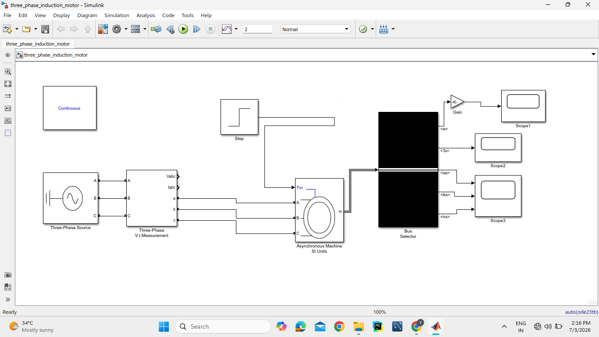
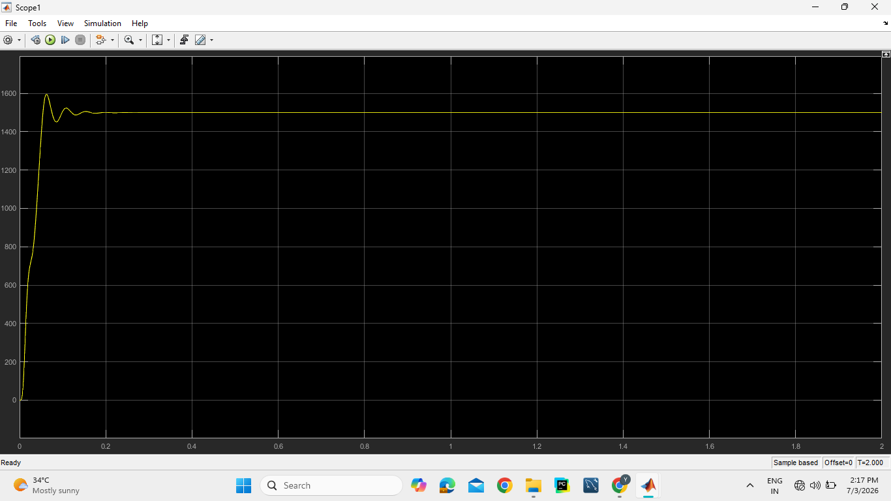
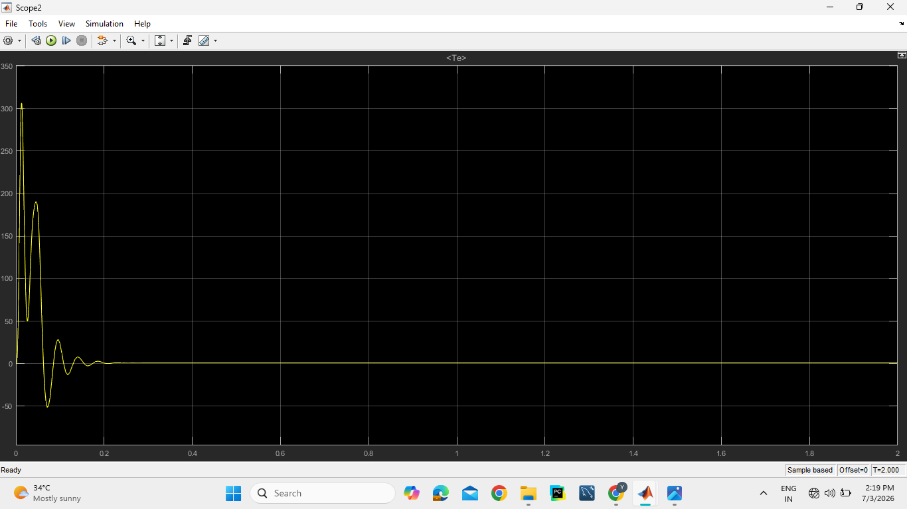
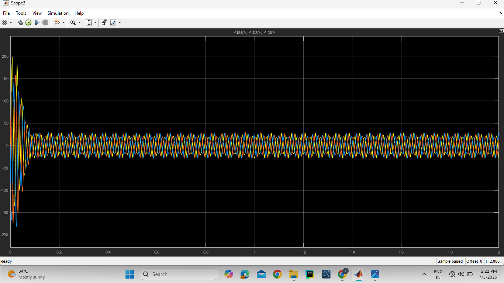

# Performance Analysis of Three-Phase Induction Motor Using MATLAB/Simulink

## Overview

This project presents the modeling and simulation of a three-phase squirrel-cage induction motor using MATLAB/Simulink to evaluate its dynamic performance under varying supply voltage and mechanical load conditions. The simulation investigates transient and steady-state characteristics by analyzing rotor speed, electromagnetic torque, and stator current, providing practical insight into induction motor behavior and validating theoretical machine concepts.

## Objectives

- Develop a dynamic MATLAB/Simulink model of a three-phase induction motor.
- Analyze motor performance under varying supply voltage conditions.
- Study the effect of varying mechanical load on motor operation.
- Observe transient and steady-state characteristics during startup and load changes.
- Compare simulation results with the theoretical operating characteristics of induction motors.

## Software Used

- MATLAB R2018a
- Simulink
- Simscape Electrical (Specialized Power Systems)

## Engineering Concepts Covered

- Three-Phase Induction Motor
- Electromagnetic Induction
- Rotating Magnetic Field
- Slip
- Torque-Speed Characteristics
- Starting Characteristics
- Electromagnetic Torque
- Stator Current Analysis
- Dynamic System Modeling
- Mechanical Load Variation
- Supply Voltage Variation

# Simulink Model

The simulation model consists of a three-phase voltage source, asynchronous machine block, mechanical load input, voltage and current measurement blocks, and output scopes used to monitor rotor speed, electromagnetic torque, and stator current under different operating conditions.

# Simulation Results

## Rotor Speed Response

The speed response illustrates motor acceleration from standstill to steady-state operation. The simulation demonstrates the influence of startup transients, varying supply voltage, and mechanical loading on the rotor speed before stable operation is achieved.

## Electromagnetic Torque

The electromagnetic torque plot shows the high starting torque required during acceleration, followed by transient oscillations and eventual stabilization as the motor reaches its operating condition under different loading scenarios.

## Three-Phase Stator Current

The stator current waveform demonstrates the initial inrush current during startup followed by balanced three-phase currents during steady-state operation. The current response varies according to the applied voltage and mechanical loading conditions.

# Working Principle

A balanced three-phase AC supply applied to the stator windings produces a rotating magnetic field. This rotating field induces current in the rotor conductors due to electromagnetic induction. The interaction between the rotating magnetic field and the induced rotor current develops electromagnetic torque, causing the rotor to accelerate. The motor continues to operate at a speed slightly lower than synchronous speed, known as slip, while responding to changes in supply voltage and mechanical load.

# Key Observations

- Rotor speed increases rapidly during startup before reaching steady-state operation.
- Electromagnetic torque exhibits high starting values followed by damped oscillations.
- High inrush current is observed during motor starting.
- Rotor speed decreases slightly with increasing mechanical load due to increased slip.
- Electromagnetic torque increases with increasing load demand.
- Supply voltage variation influences starting current, developed torque, and speed response.
- The simulation results closely follow the theoretical characteristics of a three-phase induction motor.

# Future Scope

- Closed-loop speed control using PID controllers.
- Performance comparison under different voltage-frequency (V/f) operating conditions.
- Integration with Variable Frequency Drive (VFD) control.
- Fault analysis under abnormal operating conditions.
- Comparative analysis of different induction motor ratings and operating conditions.

